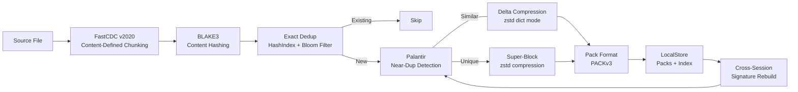

# Packt

[![Crates.io][crates-badge]][crates-url]
[![Docs.rs][docs-badge]][docs-url]
[![CI Status][ci-badge]][ci-url]
[![License][license-badge]][license-url]
[![Rust Version][rust-badge]][rust-url]

[crates-badge]: https://img.shields.io/crates/v/packt-lib.svg
[crates-url]: https://crates.io/crates/packt-lib
[docs-badge]: https://img.shields.io/docsrs/packt-lib
[docs-url]: https://docs.rs/packt-lib
[ci-badge]: https://github.com/BlackPool25/packt/actions/workflows/ci.yml/badge.svg
[ci-url]: https://github.com/BlackPool25/packt/actions/workflows/ci.yml
[license-badge]: https://img.shields.io/badge/license-MIT%2FApache--2.0-blue.svg
[license-url]: https://github.com/BlackPool25/packt#license
[rust-badge]: https://img.shields.io/badge/rust-1.85%2B-blue
[rust-url]: https://www.rust-lang.org

**Content-defined chunking with exact dedup, near-duplicate detection, and delta compression for binary data.**

Packt is a Rust library and CLI that splits binary data into content-defined chunks (FastCDC v2020), deduplicates identical chunks via BLAKE3 content-addressing, detects near-duplicate chunks using Palantir hierarchical super-features, and stores them in an integrity-verified pack format with optional zstd delta compression.

---

## Features

* **Content-Defined Chunking** — FastCDC v2020 with configurable chunk sizes (default 32 KB)
* **Exact Dedup** — BLAKE3 content-addressed with concurrent DashMap index and Bloom filter
* **Near-Duplicate Detection** — Palantir 3-tier hierarchical super-features (12 xxh3 sub-chunks, ~0 ms overhead)
* **Delta Compression** — zstd dictionary mode for similar chunks with automatic fallback
* **Streaming Pipeline** — Channel-based backpressure, ~8 MB peak memory, files of any size
* **Integrity Verification** — Every byte verified with BLAKE3 checksums, recovery from corruption
* **Cross-Session Dedup** — Similarity signatures persisted in pack format, index rebuilt on open
* **Optimized Storage** — Pack-level zstd super-block compression + auto-skip for incompressible data
* **CLI & Library** — Use as a binary or embed the library in your Rust project

## Performance

Real-world benchmarks against industry-standard tools:

| Scenario | Data | Packt | Restic | Advantage |
|----------|------|-------|--------|-----------|
| Docker cross-image (5 images) | 395 MB | **4.4x** (89 MB) | 2.7x (144 MB) | 38% better |
| Daily backups (10 sessions) | 1 GB | **4.0x** (250 MB) | 1.0x (1 GB) | 75% better |
| VM snapshots (4 versions) | 200 MB | **8.1x** (25 MB) | 3.2x (62 MB) | 60% better |
| Backup speed | 1.6 GB | **~250 MB/s** | ~100 MB/s | 2.5x faster |

Benchmark methodology: real Docker layers, synthetic daily backups (5% daily churn), VM snapshot chains.

## Quick Start

```bash
# Install from crates.io (recommended)
cargo install packt-cli

# Or install from source
git clone https://github.com/BlackPool25/packt.git
cd packt/compressor
cargo build --release -p packt-cli

# Backup a file
packt backup ./myfile.big ./backup-store/

# Show store statistics
./target/release/packt info ./backup-store/

# Verify integrity (checks every chunk)
./target/release/packt verify ./backup-store/

# Restore all files
./target/release/packt restore ./backup-store/ ./restored/
```

### CLI Reference

```
Usage: packt <COMMAND>

Commands:
  backup    Create a deduplicated backup
  restore   Restore files from a backup
  info      Show information about a backup store
  verify    Verify backup integrity
  benchmark Run performance benchmarks

Backup options:
  --chunk-size <BYTES>         Average chunk size (default: 32768)
  --similarity-threshold <0-1> Near-dup detection threshold (default: 0.7, 0=disable)
```

## Library Usage

Add to your `Cargo.toml`:

```toml
[dependencies]
packt-lib = "0.5"
```

### Basic Backup

```rust
use std::sync::Arc;
use packt_lib::chunking::fastcdc::FastCdcChunker;
use packt_lib::hash::blake3_hasher::Blake3Hasher;
use packt_lib::index::hashindex::HashIndex;
use packt_lib::pipeline::{BackupPipeline, PipelineConfig};
use packt_lib::store::local::LocalStore;
use packt_lib::types::ChunkConfig;

fn backup_example() -> Result<(), Box<dyn std::error::Error>> {
    let store = Arc::new(LocalStore::open("./backup-store")?);
    let index = Arc::new(HashIndex::new(1_000_000));
    store.populate_index(&index)?;

    let chunker = Arc::new(FastCdcChunker::new(ChunkConfig::default_32k()));
    let hasher = Arc::new(Blake3Hasher::new());

    let pipeline = BackupPipeline::new(
        PipelineConfig::default(),
        chunker,
        hasher,
        store,
        index,
    );
    let stats = pipeline.backup_file("./myfile.big")?;
    println!("Dedup ratio: {:.2}x", stats.dedup_ratio());
    Ok(())
}
```

### With Similarity Detection

```rust
use packt_lib::similarity::SimilarityConfig;

let config = PipelineConfig {
    similarity_config: Some(SimilarityConfig {
        threshold: 0.7,
        ..Default::default()
    }),
    ..Default::default()
};
```

## Architecture



### Pipeline Stages

1. **Chunking** — FastCDC v2020 splits files at content-defined boundaries (default 32 KB average)
2. **Hashing** — BLAKE3 identifies each chunk uniquely (32-byte content hash, SIMD-accelerated)
3. **Exact Dedup** — Concurrent DashMap index with Bloom filter pre-populated from existing packs
4. **Similarity Detection** — Palantir 3-tier hierarchical super-features find near-duplicate chunks
5. **Delta Encoding** — zstd dictionary mode encodes changes between similar chunks
6. **Storage** — Chunks packed into integrity-verified PACKv3 files with super-block compression

## Project Structure

```
packt/
├── packt-lib/           # Library crate (the product)
│   ├── src/
│   │   ├── chunking/    # FastCDC v2020 (streaming + sync)
│   │   ├── hash/        # BLAKE3 content hashing
│   │   ├── store/       # Pack format + delta encoder + local filesystem backend
│   │   ├── index/       # Concurrent dedup index with Bloom filter
│   │   ├── pipeline/    # Pipeline orchestrator with backpressure
│   │   ├── similarity/  # Palantir hierarchical super-features
│   │   └── types.rs     # Core types: Chunk, Hash, PackLocation
│   └── tests/           # Integration tests
├── packt-cli/           # CLI binary (demo + reference)
└── scripts/             # Benchmark and test scripts
```

## Development

```bash
# Build workspace
cargo build --workspace

# Run all tests (unit + integration)
cargo test --workspace --all-targets

# Run benchmarks
cargo bench

# Lint
cargo clippy --workspace --all-targets -- -D warnings

# Format check
cargo fmt --check

# Security audit
cargo audit
```

## Real-World Verification

```bash
# Phase 2 similarity test (Docker layers + synthetic)
./scripts/phase2_similarity_test.sh

# Comprehensive stress test
./scripts/comprehensive_stress_test.sh

# Integrity benchmark
./scripts/integrity_benchmark.sh

# Phase 3 comprehensive benchmark (vs restic)
./scripts/phase3_comprehensive_benchmark.sh
```

## License

Licensed under either of [Apache License, Version 2.0](LICENSE-APACHE) or [MIT license](LICENSE-MIT) at your option.

Unless you explicitly state otherwise, any contribution intentionally submitted for inclusion in this work by you shall be dual-licensed as above, without any additional terms or conditions.
